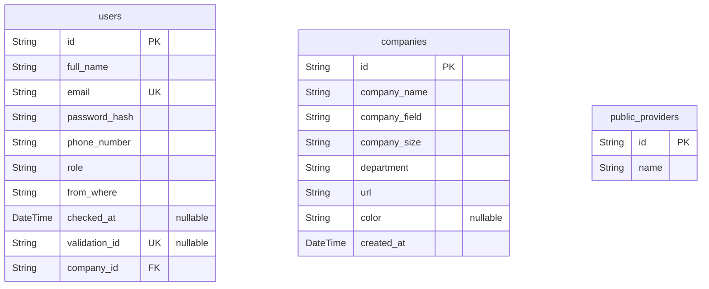

# Sign Up Flow
> Generated by [`prisma-markdown`](https://github.com/samchon/prisma-markdown)

- [default](#default)

## default

### `users`

**Properties**
  - `id`: 
  - `full_name`: 
  - `email`: 
  - `password_hash`: 
  - `phone_number`: 
  - `role`: 
  - `from_where`: 
  - `checked_at`: 
  - `validation_id`: 
  - `company_id`: 

### `companies`

**Properties**
  - `id`: 
  - `company_name`: 
  - `company_field`: 
  - `company_size`: 
  - `department`: 
  - `url`: 
  - `color`: 
  - `created_at`: 

### `public_providers`

**Properties**
  - `id`: 
  - `name`: 